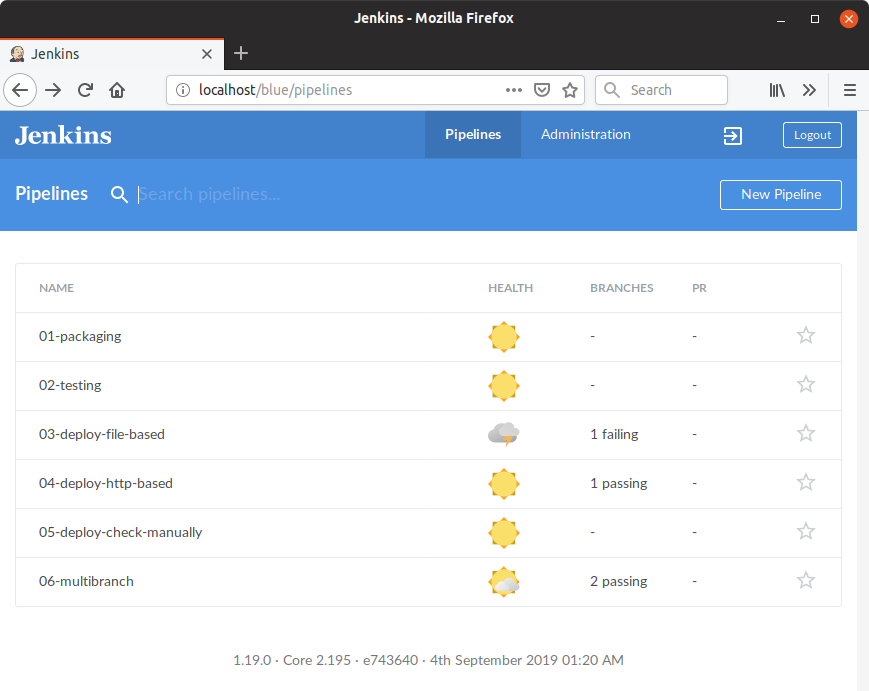
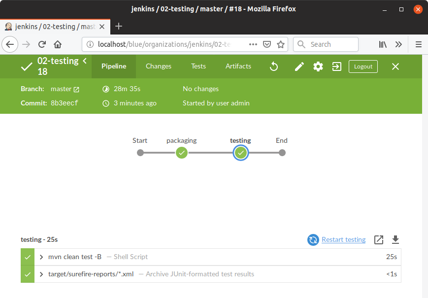
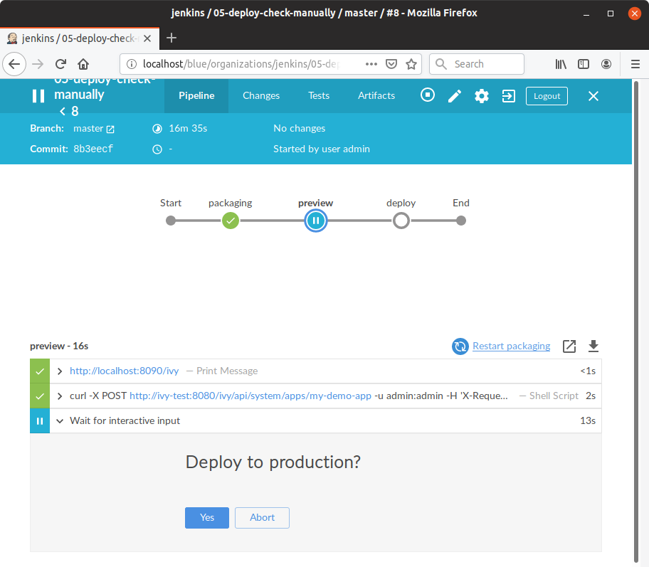

# Pipeline as Code with Axon.ivy

**Pipeline as Code** is powerful, increases quality in your CI/CD environment and saves your valuable time.

Here we show how you can use **Pipeline as Code** with Axon.ivy.
We are using Jenkins as CI/CD build infrastructure which provides **Pipeline as Codes** with `Jenkinsfile`.

## Setup

1. Start Build Environment

    Start this build environment by executing `docker-compose up` in directory `build-environment`.

    This will start a Jenkins server on http://localhost and two Axon.ivy Engines. One simulates the production engine on http://localhost:8080 and one simulates a test engine http://localhost:8090.

2. Login in Jenkins

   Goto http://localhost/login and login with **admin/admin**.

3. Scan Multi-Branch Pipeline
    
   Goto a a specific build job on Jenkins e.g http://localhost/job/01-packaging/ and click **Scan Multibranch Pipeline Now**

4. Trigger build

   Manually execute the appearing build in the list on the right site (master).
